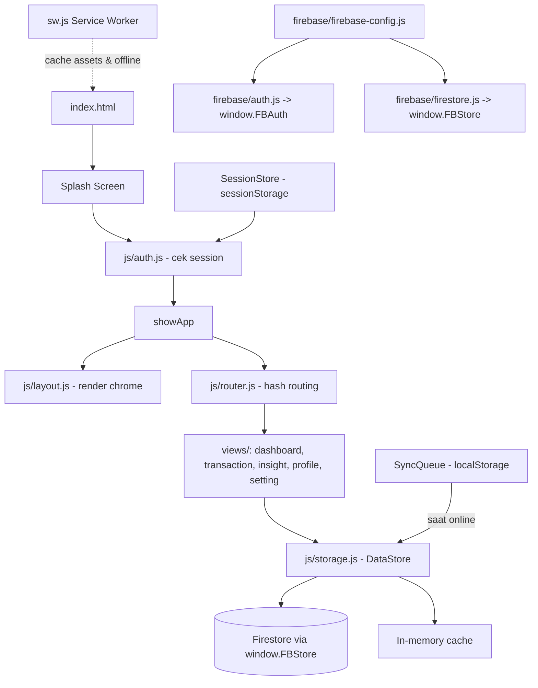

<div align="center">

# CashFlowZ

Aplikasi pencatatan keuangan pribadi (SPA + PWA) — dokumentasi pribadi repo ini.

</div>

> Catatan: ditulis untuk keperluan dokumentasi pribadi, supaya kalau buka lagi repo ini beberapa bulan ke depan langsung paham struktur, alur data, dan cara jalaninnya lagi.


---

## 📖 Ringkasan Proyek

**CashFlowZ** adalah aplikasi pencatatan keuangan pribadi berbasis web — Single Page Application sekaligus PWA — untuk mengelola pemasukan, pengeluaran, transfer, akun/dompet, kategori, merchant, dan target tabungan, semuanya jalan di browser dengan sinkronisasi realtime ke Firebase.

Dibangun full HTML5 + CSS3 + Vanilla JavaScript (campuran ES Module untuk bagian Firebase, dan classic script untuk sisanya), tanpa framework frontend (React/Vue/dll). Backend-nya Firebase (Authentication + Firestore), dilengkapi Service Worker buat kemampuan offline dan instalasi PWA.

Desainnya genre modern-minimal, brand warna hijau (hue ±155°, theme color `#29AC6B`), font Inter/Manrope/JetBrains Mono. Layout beda antara desktop (sidebar kiri) dan mobile (bottom nav + FAB).

---

## ✅ Fitur yang Sudah Ada

### Autentikasi & Session
- Login/logout via Firebase Authentication (email + password)
- Remember Me — localStorage (survive tutup browser) vs sessionStorage (hapus saat tutup tab)
- Lupa password → kirim link reset via Firebase
- Session listener realtime (deteksi logout dari server)

### Dashboard
- Greeting dinamis sesuai jam + live clock
- Summary saldo (animasi count-up) + perbandingan % periode sebelumnya
- Total income/expense periode berjalan
- Line chart cashflow (income vs expense per tanggal)
- 5 transaksi terbaru (klik → detail modal)
- Saldo per akun (dihitung otomatis: saldo awal + income − expense + transfer)
- Progress bar target tabungan
- Insight otomatis (tren cashflow, rasio pengeluaran, kategori/merchant teratas, status tabungan)

### Transaksi
- Type: Pemasukan / Pengeluaran / Transfer
- Field: tanggal, jumlah (validasi >0), akun (sorted by frekuensi pakai), kategori (tile emoji + quick-add), subkategori, merchant (quick-add), catatan
- Lampiran foto — compress max 800px, JPEG quality 0.3, max 5MB, auto-convert HEIC/HEIF (`heic2any`)
- Undo delete lewat toast

### Filter & Navigasi
- Filter pill: Semua/Pemasukan/Pengeluaran/Transfer
- Period filter: Hari Ini/Minggu Ini/Bulan Ini/Tahun Ini/Custom range
- Search realtime (title, kategori, subkategori, merchant, note, amount)
- Sort: Terbaru/Terlama/Nominal Tertinggi-Terendah/A-Z/Z-A
- Pagination 20/halaman

### Insight
6 chart Chart.js: line tren income vs expense, doughnut expense per kategori, pie income per kategori, line saldo kumulatif, bar perbandingan bulanan, doughnut expense per merchant — semua dengan drill-down klik (kategori → subkategori/note, akun → transaksi, merchant → summary + transaksi).

### Manajemen Data (CRUD)
- **Dompet/Akun** — CRUD + saldo awal + upload logo (crop square 64px PNG)
- **Kategori** — tab income/expense + subkategori CRUD
- **Merchant** — CRUD, default Shopee & TikTok Shop
- **Target Tabungan** — CRUD + progress bar dashboard + transfer ke tabungan
- **Export** — CSV (filter date/akun/kategori/type), JSON backup penuh, PDF (via `window.print()`, isi header/summary/top transaksi/3 chart/saldo/kategori/tabungan)
- **Import/Restore** — upload JSON → validasi → batch replace (max 500 ops/batch) → reload

### Profil & Setelan
- Foto profil — crop lingkaran interaktif (drag posisi) → resize 300px JPEG 0.85
- Dark mode toggle, persist ke Firestore
- Badge status koneksi realtime (Online/Offline/Syncing/Pending)
- Activity log otomatis (100 log terbaru di Firestore)
- Logout dengan konfirmasi

### PWA & Offline
- Service Worker — pre-cache static assets, cache-first untuk assets, network-first untuk CDN + fallback
- Manifest — standalone, portrait, theme `#29AC6B`, shortcut "Tambah Transaksi"
- Sync Queue — localStorage queue transaksi offline, auto-process pas online
- In-memory cache via DataStore

### Shortcut & Micro-interaction
- Ctrl/Cmd+S simpan form, Ctrl/Cmd+F fokus search, Escape tutup modal
- Animasi: view transition fade+translateY, card/button hover-lift, count-up angka, toast slide, modal rise, skeleton shimmer, chart animation 800ms

---

## 🖼️ Preview

*(belum ada screenshot — tambahkan di sini kalau sempat)*

```
[ Desktop screenshot ]      [ Mobile screenshot ]
```

---

## 🧱 Tech Stack

| Layer | Teknologi |
|---|---|
| Markup/Style | HTML5, CSS3 (base/layout/views/components/responsive terpisah) |
| Logic | Vanilla JavaScript — campuran ES Module (Firebase) + classic script (sisanya) |
| Auth & Database | Firebase Authentication + Firestore (modular SDK v10.13.2, via CDN) |
| Chart | Chart.js 4.4.3 (CDN) |
| Icon | Lucide Icons (CDN) |
| Konversi gambar | heic2any (CDN, lazy-load) |
| PWA | Service Worker (`sw.js`) + `manifest.json` |
| Build tool lokal | `sharp` (generate PNG dari SVG logo, dev-only) |

Tidak ada bundler/transpiler untuk kode aplikasi — cuma `sharp` yang dipakai sebagai dev dependency buat generate aset logo.

---

## 📁 Struktur Folder

```
CashFlowZ/
├── index.html            — Splash → Welcome → Login → App Shell
├── package.json          — dependency: sharp (generator PNG logo)
├── firebase.json         — Firebase Hosting config
├── firestore.rules       — Security rules (users/{uid} + transactions, isolated per user)
├── firestore.indexes.json — Index Firestore
├── manifest.json         — PWA manifest (standalone, theme #29AC6B)
├── sw.js                 — Service Worker (pre-cache + offline sync)
├── 404.html               — Fallback, redirect ke Dashboard
├── gen-png.js             — Script generate PNG dari SVG (pakai sharp)
├── AUDIT_CASHFLOWZ.md     — Dokumen audit internal
├── asset/logo/            — Logo SVG + berbagai ukuran PNG (icon-180/192/512, favicon-32)
├── css/
│   ├── base.css             — Design token: warna, tipografi, radius, shadow, focus ring
│   ├── layout.css            — Layout shell desktop & responsive
│   ├── views.css              — Style per halaman
│   ├── components.css          — Style komponen (button, card, modal, toast, empty state)
│   └── responsive.css           — Breakpoint 400/520/900/1180px
├── firebase/
│   ├── firebase-config.js   — Init Firebase v10.13.2, satu-satunya file berisi config project
│   ├── auth.js                — Login/logout/reset password → window.FBAuth
│   └── firestore.js            — CRUD Firestore (user doc + transactions subcollection) → window.FBStore
└── js/
    ├── auth.js               — Bootstrap auth, session, showSplash/showLogin/showApp
    ├── storage.js              — DataStore: semua CRUD, sync, compute balance, activity log
    ├── utils.js                 — formatRupiah/formatDate, escapeHtml, ConnectionStatus, SyncQueue, HEIC converter
    ├── charts.js                 — Palette & tema warna chart
    ├── layout.js                  — Sidebar, bottom nav, profile menu
    ├── router.js                   — Hash routing (#/dashboard, #/transaction, #/insight, #/profile)
    ├── views/                       — dashboard.js, transaction.js, insight.js, insight-detail.js, profile.js, setting.js
    ├── components/                   — toast.js, modal.js, sort-filter.js, period-filter.js
    └── modals/transaction.js          — Form tambah/edit transaksi lengkap
```

---

## 🚀 Cara Menjalankan

```bash
git clone https://github.com/PANJOEL113/CashFlowZ.git
cd CashFlowZ
```

Buka `index.html` langsung di browser, atau lewat server lokal:

```bash
npx serve
# atau
python -m http.server
```

Login pakai akun yang sudah terdaftar di Firebase Console (Authentication → Users). Kalau pernah login sebelumnya, session tersimpan di `sessionStorage`/`localStorage` sehingga app langsung tampil (offline-first) sambil ngecek status auth di background.

**Perintah tambahan saat development:**

```bash
node gen-png.js        # generate ulang PNG logo dari SVG (butuh `sharp`)
firebase deploy         # deploy ke Firebase Hosting
```

---

## ⚙️ Konfigurasi Penting

### Firebase

Config ada di `firebase/firebase-config.js` — satu-satunya file yang menyimpan project config, semua modul lain import dari sini.

```js
const firebaseConfig = {
  apiKey: "AIzaSy...",
  authDomain: "cashflow-92373.firebaseapp.com",
  projectId: "cashflow-92373",
  storageBucket: "cashflow-92373.firebasestorage.app",
  messagingSenderId: "1008000715079",
  appId: "1:1008000715079:web:c6c8ffa2b7e8d1369e6462",
  measurementId: "G-BWHFP0PEVQ",
};
```

- **Project ID:** `cashflow-92373`, hosting target `cflowz`
- **Auth:** provider Email/Password
- **Firestore:** database default, region `asia-southeast2`
- Rules & index diatur lewat `firestore.rules` / `firestore.indexes.json`

### Environment

Tidak ada `.env` — `apiKey` di client itu wajar untuk Firebase Web SDK (keamanan sesungguhnya ada di Firestore Security Rules, bukan di sembunyiin config). `.firebaserc` cuma berisi alias project.

### Dark Mode

Tersimpan di `users/{uid}/settings.theme` di Firestore, diterapkan lewat atribut `data-theme` di `<html>`, fallback ke `light` kalau gagal load.

---

## 🏗️ Arsitektur Sederhana



**Alur singkat:** `index.html` load → splash → `auth.js` cek session cache → `showApp()` → `router.js` baca hash URL → render view → view ambil data dari `storage.js` (DataStore, backed by Firestore + in-memory cache) → kalau offline, perubahan masuk `SyncQueue` dan otomatis dikirim ke Firestore begitu online lagi.

---

## 🛣️ Roadmap

- [ ] Registrasi mandiri (saat ini akun harus dibuat manual di Firebase Console)
- [ ] Trigger otomatis konversi HEIC/HEIF (library `heic2any` sudah ada, belum default aktif)
- [ ] Default period filter ke bulan sebelumnya
- [ ] Export Excel (.xlsx) — saat ini baru CSV/JSON/PDF
- [ ] Multi-language (EN) — teks sudah pakai variabel, tinggal butuh i18n framework
- [ ] Export chart standalone (PNG/SVG), saat ini cuma nempel di PDF
- [ ] Widget dashboard yang bisa dikustom
- [ ] Notifikasi kuota Firestore mendekati limit 1MB/doc (rule check sudah ada)

---

## 📝 Catatan Pengembangan

- **Satu file config Firebase** — `firebase/firebase-config.js`. Jangan taruh config di file lain.
- **Modular SDK v10.13.2** via CDN (`gstatic.com/firebasejs/...`), bukan npm install.
- **Mixed script type** — file Firebase pakai `type="module"` (expose `window.FBAuth`, `window.FBStore`, `window.__FIREBASE_READY__`), sisanya (`storage.js`, `utils.js`, `views/*`, dll) pakai classic `<script>`. Kalau nambah modul baru, perhatikan tipe script-nya biar nggak konflik akses `window`.
- **Offline-first** — data cache di `sessionStorage` (SessionStore), transaksi pending offline masuk `SyncQueue` (`localStorage`), auto-flush pas online.
- **Firestore rules isolasi ketat per user** — semua baca/tulis cuma boleh ke `users/{uid}` milik sendiri. Tidak ada username-list/email convention seperti di project lain.
- **Limit ukuran dokumen Firestore 1MB** — makanya semua foto (transaksi & profil) di-compress duluan (quality rendah, resize) sebelum disimpan.
- **State manager manual**, nggak pakai Redux/dsb. State tersebar di: `currentSession` (`auth.js`), `cache` in-memory (`storage.js`), `SessionStore`, `SyncQueue`.
- **View script di-load statis dari `index.html`** (bukan dynamic import) — supaya kelas view sudah tersedia sebelum router manggil `renderRoute()`. Kalau nambah view baru, jangan lupa daftarin `<script>`-nya juga di `index.html`.
- **Icon Lucide** via CDN, dipanggil ulang lewat `refreshIcons()` → `window.lucide.createIcons()` — kalau ada elemen icon baru yang nggak muncul, biasanya lupa panggil ini setelah render.
- **Chart.js tema ikut dark/light** — warnanya dikustom berdasarkan `data-theme`.

---

## ❓ FAQ Singkat

**Lupa password?**
Klik "Lupa Password?" di halaman login → masukkan email → link reset dikirim via Firebase Auth.

**Data hilang kalau clear cache browser?**
Nggak — data transaksi otentik di Firestore. Yang di local (session/tema sementara) bisa hilang, tapi begitu login ulang semua data balik muncul dari Firestore.

**Bisa dipakai offline?**
Bisa, asal pernah login sekali (session tersimpan). Transaksi baru saat offline masuk antrean `SyncQueue` dan otomatis terkirim pas online lagi. Fitur realtime (update chart otomatis dari device lain) mati sementara sampai online.

**Cara hapus akun permanen?**
Nggak ada tombol delete account di dalam app — harus manual lewat Firebase Console (Authentication → Users) atau Admin SDK.

**Kenapa tanggal formatnya Indonesia padahal disimpan ISO string?**
Karena semua fungsi format tanggal di `js/utils.js` pakai `toLocaleDateString("id-ID", ...)` — data mentahnya tetap ISO, cuma tampilannya di-lokalisasi.

---

<div align="center">

**CashFlowZ** · v1.0.0 · Project ID `cashflow-92373` · Lisensi ISC
Dokumentasi pribadi — biar nggak bingung sendiri pas buka lagi nanti.

</div>
